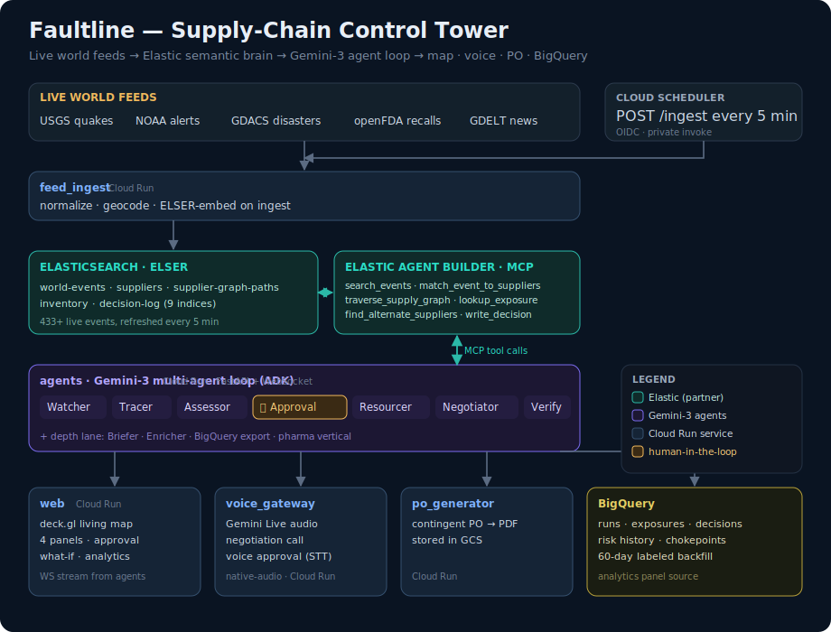

# Faultline — Supply-Chain Control Tower Agent

An autonomous supply-chain control tower for the **Google Cloud Rapid Agent Hackathon**
(**Elastic** partner track). Faultline watches live world feeds (earthquakes, storms,
recalls, news), semantically matches disruptions to a multi-tier supplier graph in
**Elasticsearch**, quantifies exposure ($ at risk, days of cover), and — gated by human
approval — re-sources supply autonomously: finds qualified alternates, drafts contingent
POs, confirms by voice call, and verifies the gap is closed. All of it narrated live on
a glowing world map.

**▶ Live demo:** https://faultline-web-bikt55l3xa-uc.a.run.app
&nbsp;·&nbsp; append `?demo=replay` for the deterministic 70-second incident walkthrough.

> **Status: live.** 433+ real events from five feeds stream into a real Elasticsearch
> cluster (ELSER-embedded, refreshed every 5 min); the full Gemini-3 agent loop runs in
> production against six Elastic MCP tools; voice works both directions; five Cloud Run
> services are deployed. The demo company is seeded — everything else is real (see
> **Honesty notes**).

## Architecture



**Flow:** Cloud Scheduler pings `feed_ingest` every 5 min → five live feeds normalize into
**Elasticsearch** (ELSER semantic embeddings on ingest). The **agents** service runs a
Gemini-3 multi-agent loop (ADK) that reasons *only* through the **Elastic Agent Builder MCP
server** — semantic event→supplier matching, supply-graph traversal, exposure math, and the
decision log. Analysis is autonomous; **action is gated by a human approval** (click or
voice). On approval the Resourcer finds alternates, `po_generator` renders a contingent PO to
GCS, and `voice_gateway` places a Gemini-Live negotiation call. Every run streams over a
WebSocket to the **deck.gl** control-tower UI and exports to **BigQuery** for risk history.

## Stack
- **Agents:** Google Cloud Agent Builder — ADK (Python) multi-agent system on **Gemini 3**
  (`gemini-3.1-pro-preview` orchestration/reasoning, `gemini-3.5-flash` everywhere else;
  voice on `gemini-live-2.5-flash-native-audio`). Gemini runs at `location=global`.
- **Partner MCP:** **Elastic Agent Builder MCP server** — load-bearing: semantic event→supplier
  matching (ELSER), graph traversal, exposure lookup, decision log. Every call surfaced in the UI.
- **Frontend:** React + Vite + deck.gl living map, served from Cloud Run (nginx).
- **Data:** live feeds (USGS, NOAA, GDACS, openFDA, GDELT) → Elasticsearch; BigQuery analytics
  (60-day labeled backfill for the risk-history panel).
- **Cloud Run services:** `agents` · `feed-ingest` · `po-generator` · `voice-gateway` · `web`,
  with Cloud Scheduler (OIDC) driving ingest and Secret Manager holding credentials.

## Repo map (one writer per area — see parallel plan §3)
```
contracts/   frozen interfaces + golden fixtures + ws_replay.jsonl   (the parallelism enabler)
agents/      ADK multi-agent system + FastAPI WS bridge              [B, depth/ = G]
elastic/     index mappings + Agent Builder tool definitions         [A]
data/        deterministic seed generator + company profiles         [A]
services/    feed_ingest · po_generator · voice_gateway              [D, E]
web/         React control-tower UI (map hero + panels)              [C1, C2, E, G]
infra/       setup.sh · env.example · deploy.sh · web.* fallback     [F]
```

## Quickstart (local)
```bash
cp infra/env.example .env                     # fill in credentials (never committed)
pip install -r requirements-dev.txt && pytest contracts/   # validate contract fixtures
cd agents && pip install -r requirements.txt && uvicorn main:app --port 8080   # /health, /ws
cd web && npm install && npm run dev          # control tower on replay fixtures (?demo=replay)
```

## Deploy
```bash
bash infra/deploy.sh                          # all services + scheduler (reads repo-root .env)
bash infra/deploy.sh agents feed_ingest       # any subset
# Web ships via Cloud Run (Firebase ToS-free): build infra/web.Dockerfile and
# `gcloud run deploy faultline-web --port=8080 --allow-unauthenticated`.
```

## Honesty notes (kept current for judging)
World events are **live** ingested feeds; the demo company ("Northwind Provisions") and its
supplier graph are **seeded**; matching, traversal and scoring are real. What-if scenarios run
the identical pipeline flagged `simulated:true`. The negotiation-call counterparty is a
role-played supplier persona (disclosed in the video). BigQuery history includes a labeled
60-day backfill (every synthetic row carries `backfill:true`); the live incident is real.

## License
Apache-2.0 — see [LICENSE](LICENSE).
